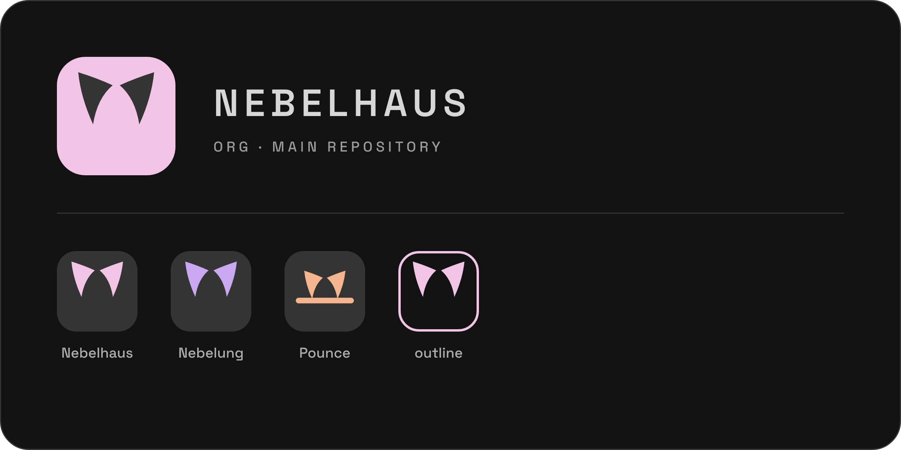

<div align="center">

<!-- the family — org showcase (profile/assets/family-showcase-rounded.png) -->


**an opinionated macOS, raised in the fog**

silver-grey · keyboard-first · reproducible · nix-native

<!-- assets/hero.png — the whole desktop: Sill bar, Prowl tiling, Pounce open, Nebelung everywhere -->


</div>

---

macOS, arranged like a tiling Linux rig but native to the grain of the Mac —
one Nix flake raises the whole house. Fog-grey, quiet, and reproducible:
wipe the machine, run one command, and the house stands again exactly as it was.

Think *omarchy*, but for macOS instead of Arch.

## the house

| | | |
|---|---|---|
| 🐾 **[Pounce](https://github.com/nebelhaus/pounce)** | native command palette | summon, aim, pounce — a scriptable, keyboard-first launcher. every command is a file. |
| 🌫️ **[Nebelung](https://github.com/nebelhaus/nebelung)** | the theme | a silver-mist Catppuccin variant, whiskered to every app you own. |
| 🏠 **[nebelhaus](https://github.com/nebelhaus/nebelhaus)** | the flake | the whole rice — the den, the prowl, the sill, the collar, in one reproducible tree. |

Inside the flake:

- **Den** — the nix-darwin + home-manager foundation everything rests on.
- **Prowl** — opinionated AeroSpace tiling. stake out your screen.
- **Sill** — a SketchyBar setup that perches on the top edge and watches.
- **Collar** — YubiKey identity & sudo / Touch-ID, done the sane way.

## raise your own

```sh
# nix-native (recommended) — scaffolds a thin config of your own
nix run github:nebelhaus/nebelhaus#bootstrap

# or try just the palette, no install:
nix run github:nebelhaus/pounce -- --help
```

Take the whole house, or steal one room — every piece stands on its own.
Hacking on the family itself? Start from the
[workshop](https://github.com/nebelhaus/workshop), which checks out every repo
side by side and ships the `haus` CLI for the cross-repo flow.

## the fog

Grey is the point. Nebelung is a low-contrast, muted dark palette for people
who find Mocha too loud — a cat breed the colour of high fog, hence the name.

---

MIT · built on [Nix](https://nixos.org), [nix-darwin](https://github.com/LnL7/nix-darwin), [AeroSpace](https://github.com/nikitabobko/AeroSpace), [SketchyBar](https://github.com/FelixKratz/SketchyBar), and [Catppuccin](https://github.com/catppuccin).
